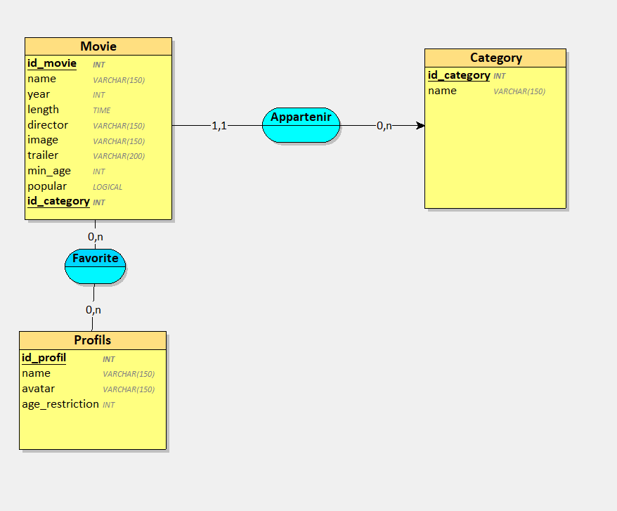

## Justifications des cardinalités des association de tables (Looping)

APPARTENIR :  relation entre Movie et Category

côté movie (1,1) : Un film appartient au minimum à 1 catégorie et au maximum à 1 catégorie

côté category (0,n) : Une catégorie peut contenir au minimum 0 film et au maximum n films

FAVORITE : relation entre Movie et Profils

côté movie (0,n) : Un film peut être mis en favori par au minimum 0 profil et au maximum n profils

côté profils (0,n) : Un profil peut posséder au minimum 0 favori et au maximum n favoris

## Organisation des tables

J'ai utilisé un préfixe SAE203_ devant chaque table pour isoler les tables de la sae avec mes autres tables existantes

Chaque tables possède une clé primaire qui correspond à l'id donc il est de type INT (identifiant)

Toutes mes tables : 
* SAE203_Movie : cette table contient tout les films avec leur titre, l'année de sortie, la durée du film, une description, le réalisateur, l'id de la catégorie, le nom de l'image, l'url du trailer, l'âge minimum et si le film est populaire ou non

* SAE203_Category : cette table contient toutes les catégories des film avec l'id, et le nom de la catégorie

* SAE203_Profils : cette table contient toutes les données des différents profils avec leur nom, le nom du fichier de leur image avatar et leur âge

* SAE203_Favorites : cette table est la liaison entre la table des profils et la table des films

## Justifications des types de données et longueurs

Table Movie :

* l'id c'est un entier identifiant
* J'ai choisi les VARCHAR à 150 pour le réalisateur et les noms des images car les titres des films et le nom des réalisateurs peut être assez long 
* Pour l'année j'ai choisi un entier INT
* Pour la durée du film, j'ai choisi le type TIME au format heure
* Pour le trailer, j'ai choisi VARCHAR à 200 car les liens peut être assez long
* l'âge est de type entier
* popular est de type booléen, 0 ou 1

Table Category : 

* l'id c'est un entier identifiant
* le nom de la catégorie est un VARCHAR de 150 caractères maximum

Table Profils : 

* l'id c'est un entier identifiant
* le nom de la catégorie est un VARCHAR de 150 caractères maximum
* l'avatar est un varchar 150 car le nom du fichier peut être long
* l'âge du profil est un entier

## Explication des requêtes SQL dans le code PHP

ITÉRATION 1 : Consulter la liste des films proposés par la plateforme

"SELECT SAE203_Movie.id, SAE203_Movie.name, SAE203_Movie.image, SAE203_Category.name AS category_name 
FROM SAE203_Movie
JOIN SAE203_Category ON SAE203_Movie.id_category = SAE203_Category.id
WHERE SAE203_Movie.min_age <= :ageLimite
ORDER BY SAE203_Category.name ASC, SAE203_Movie.name ASC;"

--> J'ai utilisé JOIN pour récupérer le nom de la catégorie associé à chaque film avec l'id_category. Puis je l'ai filtrer avec le WHERE pour que l'utilisateur ne voit que les films pour son âge.

ITÉRATION 2 : Ajouter des films dans la base de données

"INSERT INTO SAE203_Movie (name, director, year, length, description, id_category, image, trailer, min_age) VALUES (:name, :director, :year, :length, :description, :id_category, :image, :trailer, :min_age)"

--> cette requête permet cibler la table SAE203_Movie avec ses colonnes associées : le nom, la durée du film, la description...

ITÉRATION 3 : Consulter les informations détaillées d'un film ainsi que son trailer

"SELECT SAE203_Movie.*, SAE203_Category.name AS category_text 
FROM SAE203_Movie 
LEFT JOIN SAE203_Category ON SAE203_Movie.id_category = SAE203_Category.id 
WHERE SAE203_Movie.id = :id"

--> la requête récupère les colonnes de la table movie en utilisant LEFT JOIN pour lier les deux tables avec l'identifiant de catégorie. 

ITÉRATION 4 : Afficher les films en regroupant par catégorie

"SELECT id, name FROM SAE203_Category ORDER BY name ASC"

--> la requête permet de récupérer l'identifiant et le nom de la catégorie dans l'ordre alphabétique

ITÉRATION 5 : Avoir un formulaire pour ajouter des profils utilisateur

"INSERT INTO SAE203_Profils (name, avatar, age_restriction) VALUES (:name, :avatar, :age_restriction)";

--> la requête accède au le nom, avatar et âge de restriction du profil

ITÉRATION 6-7-8 : Pouvoir choisir un profil utilisateur (modifier)

"SELECT id, name, avatar, age_restriction FROM SAE203_Profils ORDER BY name ASC";

--> cette requête parcourt l'intégralité de la table des utilisateurs en les triant par ordre alphabétique

ITÉRATION 9 : Pouvoir ajouter des films à une liste de favoris par profil utilisateur

"INSERT INTO SAE203_Favorites (id_profile, id_movie) VALUES (:id_profile, :id_movie)";

--> la requête cible la table de liaison favorites  avec les deux clés étrangères des tables movie et profile

ITÉRATION 10 : Pouvoir retirer un film de sa liste de favoris 

"SELECT SAE203_Movie.id, SAE203_Movie.name, SAE203_Movie.image 
FROM SAE203_Movie 
INNER JOIN SAE203_Favorites ON SAE203_Movie.id = SAE203_Favorites.id_movie 
WHERE SAE203_Favorites.id_profile = :id_profile";

--> la requête permet d'extraire l'identifiant, le nom et l'image des films de la table movie et de la croiser  avec la table des films favorites, pour garder que les films qui sont en favoris et en ciblaant bien avec l'id d'un seul utilisateur

ITÉRATION 11 : Avoir des films mis en avant 

"SELECT * FROM SAE203_Movie WHERE popular = 1 AND min_age <= :age";

--> la requête récupère toutes les données de la table movie et les cible avec un WHERE ou les films avec un 0 sont ignoré. Puis le AND permet de gadrer la restriction du film selon l'âge

ITÉRATION 12 : Pouvoir consulter des statistiques

"SELECT COUNT(*) AS nb FROM SAE203_Profils";

--> la requête compte le nombre total d'entrées dans la table movie

"SELECT SAE203_Movie.name FROM SAE203_Favorites 
JOIN SAE203_Movie ON SAE203_Favorites.id_movie = SAE203_Movie.id 
GROUP BY SAE203_Favorites.id_movie 
ORDER BY COUNT(*) 
DESC LIMIT 1";

--> cette requête vise la table movie et fait un JOIN entre les films et les favoris. Ils sont groupé par identifiant de film et COUNT permet de compter le nombre d'occurences de chaque film dans la liste des favoris, ils sont triés par ordre décroissant et on un LIMIT 1 pour arrêter le processus de recherche quand un premier résultat est trouvé

## Capture d'écran de la vue Looping 

